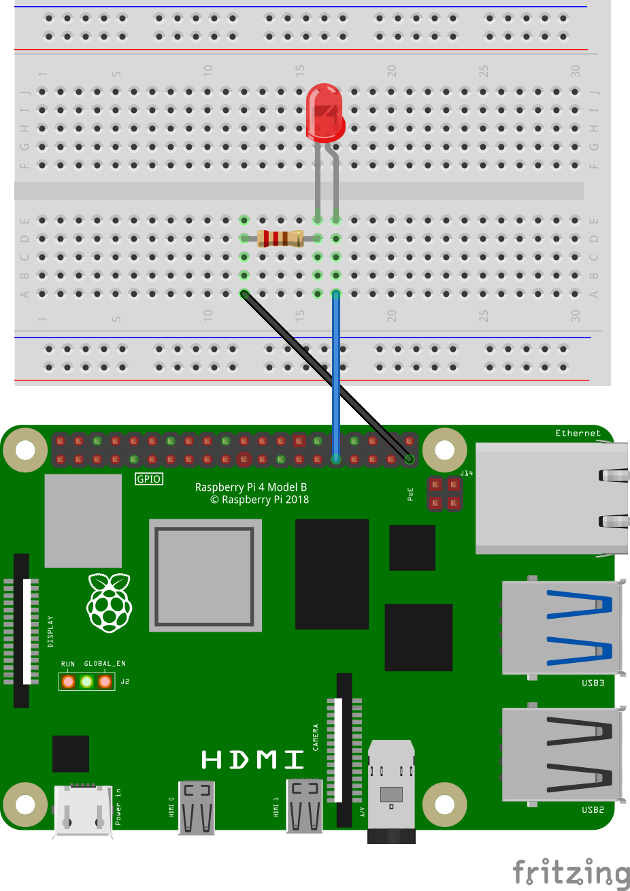
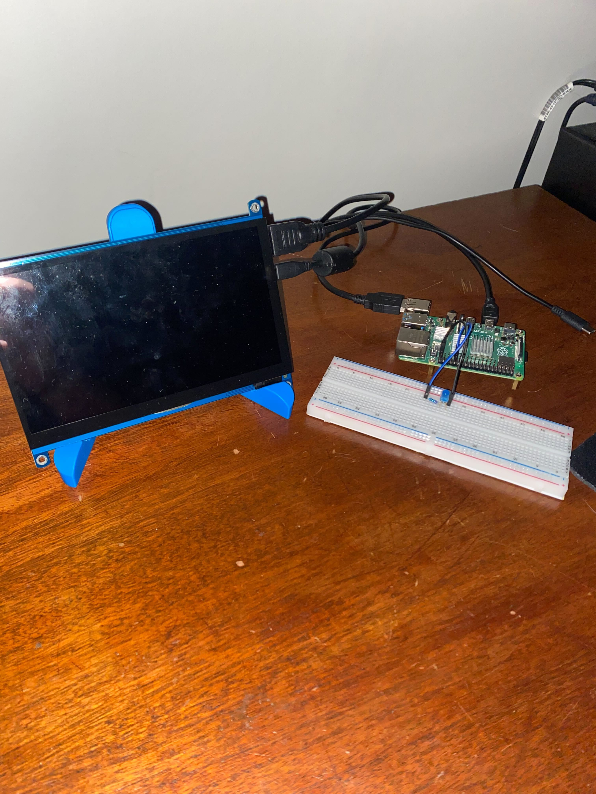
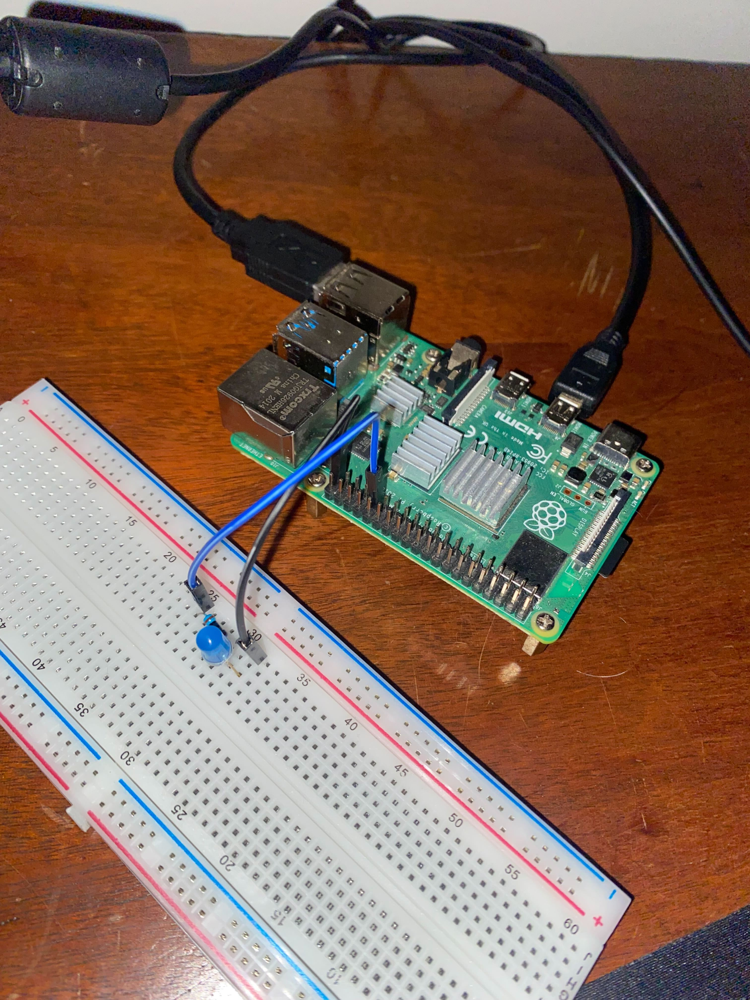

# machine-control-os

This repository utilizes the [Yocto Project](https://www.yoctoproject.org/)'s [Poky](https://www.yoctoproject.org/software-item/poky/) reference distribution to a create the `core-image-base` image for the [Raspberry Pi 4](https://www.raspberrypi.org/products/raspberry-pi-4-model-b/) with a custom layer ([meta-machine-control](meta-machine-control/README.md)) that contains the necessary recipes to include the [unleashing_grpc](https://github.com/lapumb-spindance/unleashing-grpc) Flutter backend and frontend applications as services. The OS itself is very simple and is responsible for three things:

1. Connecting to the network (via wifi or ethernet)
1. Spinning up the [`unleashing-grpc-backend.service`](meta-machine-control/recipes-app/unleashing-grpc-backend/files/unleashing-grpc-backend.service), which spins up a gRPC server and controls the state of the connected LED
1. Spinning up the [`unleashing-grpc-frontend.service`](meta-machine-control/recipes-app/unleashing-grpc-frontend/files/unleashing-grpc-frontend.service), which spins up a Flutter application that connects to the gRPC server and allows the user to control the state of the connected LED

>Note: if you are interested in learning more about embedded Flutter, checkout the [meta-flutter](https://github.com/meta-flutter/meta-flutter) repository and the ["_Getting Started with Flutter for Embedded Linux_" blog](https://spindance.com/2024/07/10/getting-started-with-flutter-for-embedded-linux-2/)!

This repository is referenced in the "_Unleashing gRPC_" blog series. Check out the blogs for more information on what is being built!

Part 1: [Getting Started with Machine Control Using Flutter and gRPC](https://spindance.com/2024/09/23/unleashing-grpc-part-1-getting-started-with-machine-control-using-flutter-and-grpc/)

Part 2: [Diving Deeper into Machine Control Using Flutter with gRPC](https://spindance.com/2024/09/24/unleashing-grpc-part-2-diving-deeper-into-machine-control-using-flutter-with-grpc/)

## Prerequisites

>:warning: **Yocto Project tooling is required to run in a Linux environment.** If you are on Windows or an Intel-based Mac, you will need to setup a Linux environment. Please note that, although this is tooling in this repository to facilitate developing on Windows/MacOS, **full support is not guaranteed**.

See the [Dockerfile](.devcontainer/Dockerfile) for the full list of dependencies if you are on a Linux host.

If you are on a Windows 11 (or 10) host, see [windows_11_setup_steps.md](docs/windows_11_setup_steps.md) for instructions on setting up your environment.

## Getting Started

Clone this repository:

```bash
git clone --recursive git@github.com:lapumb-spindance/machine-control-os.git
```

>Note: if you do not add the `--recursive` flag, run `./tools/update_submodules.sh` once the repository has successfully been cloned.

### Containerized Development

This repository utilizes Yocto Project tooling that is **required to be run in a Linux environment**. Since not everyone has access to a Linux machine, this repository has been containerized using [Visual Studio Code Remote Containers](https://code.visualstudio.com/docs/remote/containers). This allows you to develop in a Linux environment without having to install Linux on your machine.

If you choose to use a containerized environment for development, the following dependencies must be installed:

**MacOS**:

```bash
brew install node
npm install -g @devcontainers/cli
```

**Linux / WSL2**:

>Note: along with the following dependencies, if you are working in WSL(2) and have not already done so, it is probably a good idea to hike up your resources. For example, on a machine with 16GB RAM and 20 (logical) cores, you may want a configuration like the following in your `${env:USERPROFILE}\.wslconfig`:
>
  > ```txt
  >[wsl2]
  >memory=14GB
  >swap=4GB
  >processors=18
  >```
>
> See [the Microsoft documentation](https://learn.microsoft.com/en-us/windows/wsl/wsl-config#wslconfig) for more information about the `.wslconfig`.

```bash
sudo apt install nodejs npm -y
sudo npm cache clean -f
sudo npm install -g n
sudo n stable
sudo npm install -g @devcontainers/cli
```

:warning: If you opt to develop directly in WSL(2), be sure to install the dependencies outlined in the [Dockerfile](.devcontainer/Dockerfile).

[Docker Desktop](https://www.docker.com/products/docker-desktop) must also be installed and running. **Make sure you are signed into a docker account (free is fine) and docker is running**.

#### Visual Studio Code

>**Note: before proceeding, make sure you have the [Dev Containers Extension](https://marketplace.visualstudio.com/items?itemName=ms-vscode-remote.remote-containers) installed and enabled in Visual Studio Code.**

To utilize the container defined in this repository, open this repository in Visual Studio Code. You will likely be greeted with a prompt to "_Reopen in Container_". If so, click the "_Reopen in Container_" button, which will create a Docker container (if necessary) and mount you at the location of this repository in the container filesystem. If not, open the command palette (Mac: `Cmd+Shift+P`, Windows: `Ctrl+Shift+P`) and search for "Remote-Containers: Reopen in Container". A new VSCode window will open with the container running, where you can execute all your `git` commands and run the Yocto Project tooling.

#### Command Line

If you do not want to use VSCode, you can still use the containerized environment. From the root of this repository, run the following command, which will create a Docker container (if necessary) and mount you at the location of this repository in the container filesystem:

```bash
./.devcontainer/enter_container.sh
```

>To exit the container, enter the `exit` command.

#### Important Note Regarding Containerized Development

It has been observed that errors occur when attempting to enter the container in VS Code after having already entered the container from the command line (and / or vice-versa). If you run into this issue, delete the image / container that was spun up by the other method and try again. **That said, it is probably best to stick to one method of entering the container until we figure out a more graceful solution**.

### Non-Containerized Development

Don't want to use a Docker container to build? No problem! See the [Yocto Project Quick Start](https://docs.yoctoproject.org/dev-manual/start.html#preparing-the-build-host) for setting up either your native Linux host.

### Project-Level Environment Setup

Once you have your Linux environment setup, it is time to setup the project environment by sourcing the `.envrc` file:

```bash
source .envrc
```

This can be done manually, or you can use [direnv](https://direnv.net/) (`sudo apt install direnv`) to automatically source this file when you enter the project directory.

>Note: if using `direnv`, ensure the tool is properly [hooked into your shell](https://direnv.net/docs/hook.html).

#### Custom Configurations

The `.envrc` file also sources a `.userenv` file if one is available. This file is ignored by git, so you can add any custom environment variables or overwrite any existing environment variables you see fit. For an example `.userenv` file, see the [example](.userenv.example) file.

Two particularly useful environment variables suggested to `export` in the `.userenv` file are `NETWORK_SSID` and `NETWORK_PASSWORD`. These variables are used to configure `wpa_supplicant` on the image so the Raspberry Pi automatically connects to your network upon boot.

### The `bitbake` Command

This repository is setup in a way that makes it simple for multiple developers to contribute to the same project. In order to achieve this, several custom environment variables have to be sent to `bitbake` to map dynamic paths correctly. Because of this, using the raw `bitbake` command **will not work**. Instead, utilize the `execute_bitbake.sh` script to properly source the environment variables and execute `bitbake`:

```bash
./execute_bitbake <additional_args_here>
```

>Note: this script is used within the [build.sh](build.sh). Do not use this script directly unless you are experienced with the Yocto Project tooling.

## Building and Flashing an Image

Once you have your environment setup and your hardware connected, it is time to build and flash the image to a uSD card. Building has been simplified to a `build.sh` script, which will build the `core-image-base` image by default. To build the image, simply run `./build.sh`.

Once the build completes successfully, you can flash the image to a uSD card by running `./flash.sh` **if you are working on a native Linux machine**. This script will automatically detect the newest image, but you also have the option to supply a specific image. Run `./flash.sh -h` for more information.

If you are _not_ on a native Linux machine, use the following for flashing:

- Windows: [rufus](https://rufus.ie/en/)
  >Keep the default options, but when "SELECT"ing a file, make sure to change the filter to `All files (*.*)`. When you plug in your uSD card, Windows will complain. Only focus on the `rufus` application and do not do anything with any explorer windows that pop up.
- MacOS: [balenaEtcher](https://etcher.balena.io/#download-etcher)

Since this repository builds an image that is intended to run on the Raspberry Pi 4b, you could also use the [Raspberry Pi Imager](https://www.raspberrypi.org/software/) to flash the image.

## Hardware Setup

- [Raspberry Pi 4b](https://www.raspberrypi.org/products/raspberry-pi-4-model-b/)
  >This repository sets the `MACHINE` variable to `raspberrypi4` by default. Theoretically, any Raspberry Pi Single Board Computer (SBC) should work. If you opt to go with a different Raspberry Pi SBC, `export MACHINE=<your_machine_here>` in your `.userenv` file after finding your machine name [here](meta-raspberrypi/conf/machine).
- [uSD card](https://a.co/d/j359Wjg)
  >The generated `.wic` image is  < 600MB, so a 2GB uSD card should be sufficient, but it's always nice having a larger card laying around for future projects.
- [USB-C power supply](https://www.raspberrypi.com/products/type-c-power-supply/)
- [Micro HDMI to HDMI cable](https://a.co/d/cD6o5ns) (or adapter if you have an extra HDMI already laying around)
- [Waveshare 7" Capacitive Touch Display](https://www.waveshare.com/7inch-hdmi-lcd-h.htm)
  >Having a touchscreen display is not a necessity, but it is nice to actually interact with the device. If you opt to use a different HDMI display, you may want a USB mouse to interact with the UI.
- [Breadboard kit](https://a.co/d/0r9hxvH)
- (Optional for debugging) [USB to TTL Serial Cable](https://www.digikey.com/en/products/detail/espressif-systems/ESP-PROG/10259352)
  >I like the ESP-Prog, but any USB to TTL Serial Cable should work. This is used to monitor the serial output of the Raspberry Pi.
- (Optional) [Ethernet cable](https://a.co/d/f6xYfYF)
  >If you do not have a wireless network or do not have an TTL cable to setup your credentials, you can use an ethernet cable to connect the Raspberry Pi to your network.

To hook up your LED to the Raspberry Pi, plug a 5mm LED into the breadboard and connect the longer leg (anode) to GPIO 6 (pin 31) and the shorter leg (cathode) to a 10KΩ resistor, which is then connected to a ground pin (pin 39). See the [Raspberry Pi Pinout](https://www.raspberrypi.com/documentation/computers/images/GPIO-Pinout-Diagram-2.png?hash=df7d7847c57a1ca6d5b2617695de6d46) for exact pin locations.

>If you opt to use a different GPIO pin, be sure to set the correct `LED_GPIO=<your_gpio_here>` in the [`local.conf`](conf/local.conf) file.







## Serial Monitoring

On the ESP-Prog, we will use the 6-pin breakout section. Below is the pin layout for this section (`x`'s denote pins we don't care about):

```text
    +--------------+
    |  x   GND  x  |
    |  x   TX  RX  |
    +-----    -----+
```

>NOTE: Notice the orientation of the break in the bottom of the wall around these pins; please make sure when you are wiring this, that break is facing down/south.

Once you have wires connected to those pins, please connect them to their respective pins on the Raspberry Pi breakout header:

```text
    +-----------+
    |  x   x    |
    |  x   x    |
    |  x   GND  |
    |  x   TX   |
    |  x   RX   |
    |  x   x    |
    |  ..  ..   |
    +-----------+
```

>NOTE: When looking at the Raspberry Pi, the above diagram assumes an orientation where the pins on the **right** side of the board.

Once the connections are made, you can monitor serial output from your Raspberry Pi by executing `picocom` (`sudo apt install picocom`), `minicom` (`sudo apt install minicom`), or any other serial monitoring tool of your choice after finding your device (`ls /dev/ttyUSB*`) and setting the baud rate to `115200`:

```bash
# To exit picocom, press Ctrl+A followed by Ctrl+X.
picocom -b 115200 /dev/ttyUSB1
```

## A Few Notes

- **The first build will take a long time.** Subsequent builds will be faster due to the caching mechanism of the Yocto Project.
- If the image was built without wifi credentials, use the following command after creating an TTL connection to the Raspberry Pi:

  ```bash
  # Setup wifi credentials in the wpa_supplicant.conf file
  wpa_passphrase "NETWORK_SSID" NETWORK_PASSWORD >> /etc/wpa_supplicant.conf

  # Reconfigure the wpa_supplicant service
  wpa_cli reconfigure
  ```

  >Take note of the lack of quotes around `NETWORK_PASSWORD` in the command above. This is intentional as the `wpa_passphrase` command will include the quotes in the generated PSK.
- The `unleashing-grpc-backend.service` will not start until an IP is obtained on `wlan0` which could take a minute or so. This is because the gRPC server needs a connection in order to serve.

## Helpful Resources

- [Yocto Project Documentation](https://docs.yoctoproject.org/4.0.11/singleindex.html)
- [OpenEmbedded Layers Index](https://layers.openembedded.org/layerindex/branch/kirkstone/layers/)
- [DigiKey Yocto Project Introduction](https://www.youtube.com/playlist?list=PLEBQazB0HUyTpoJoZecRK6PpDG31Y7RPB)
  >The first video in the series is focused on [buildroot](https://buildroot.org/), but the rest of the videos are focused on the Yocto Project.

## Contributing

Want to contribute to this repository? Feel free to open a pull request, file an issue, or make a suggestion!
